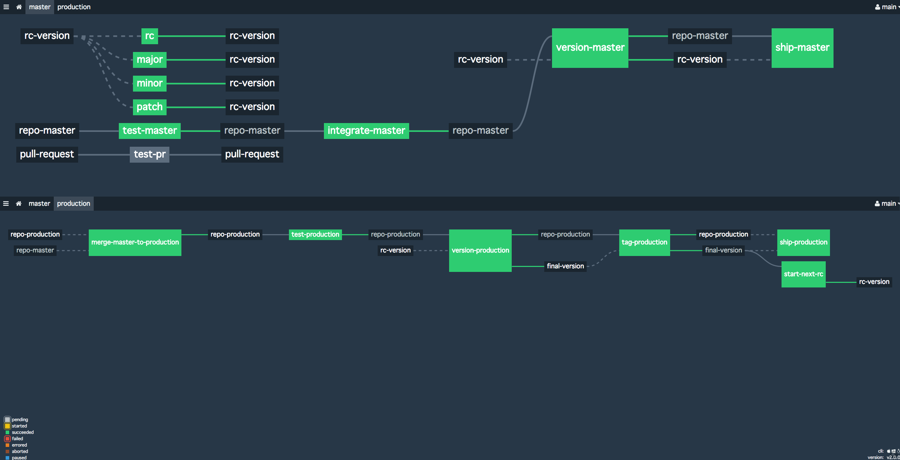
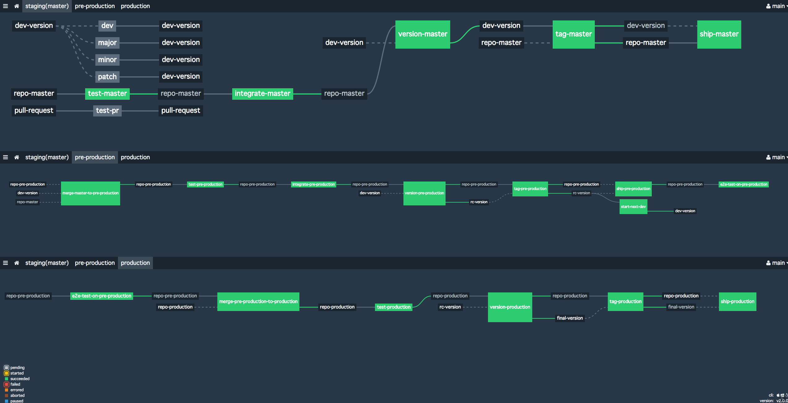

# concourse-gitlab-flow
This repository has two concourse pipeline examples supporting two [Gitlab flow](http://docs.gitlab.com/ee/workflow/gitlab_flow.html) model below:

* [Production branch with GitLab flow](http://docs.gitlab.com/ee/workflow/gitlab_flow.html#production-branch-with-gitlab-flow)
* [Environment branches with GitLab flow](http://docs.gitlab.com/ee/workflow/gitlab_flow.html#environment-branches-with-gitlab-flow)

# [Production branch with GitLab flow](http://docs.gitlab.com/ee/workflow/gitlab_flow.html#production-branch-with-gitlab-flow)
[Production branch with Gitlab flow](http://docs.gitlab.com/ee/workflow/gitlab_flow.html#production-branch-with-gitlab-flow) assumes two major branches.

* `main` branch:  This branch is for tracking production 'grade' code, it can be seen as release candidates.  Not as github flow, master branch is not for tracking production codes.
  * features branch: as standard git flow and github flow, this is for developing each feature and will be merged to master.
* `production` branch:  This is the branch for tracking production code. Every commit on the branch will be shipped to the production environment.

## [Concourse pipeline to support "Production branch with Gitlab flow"](ci/2-envs.yaml)

[2-envs.yml](ci/2-envs.yml) supports that:
* Semantic versioning by [semver-resource](https://github.com/concourse/semver-resource)
* Continuous Integration(CI) for pull requests.
* Continuous Deployment(CD) of `master` branch
  * deployment to `staging` environment bumps release candidate version (stored in `rc-version` resource)
    * release candidate version will be of the form `x.y.z-rc.n`
* CI/CD of `production` branch
  * `merge-master-to-production` job is the trigger to start deployment to production.
  * Succeeding jobs performs CI/CD
   * `version-production` job always computes final version from `rc-version` resource and stores it to `final-version` resource.
    * If release candidate version was `x.y.z-rc.n`, final version will be `x.y.z`
   * `start-next-rc` is executed after `tag-production`.  This stores next release candidate version to `rc-version` resource.
     * If `x.y.z` will be tagged, `start-next-rc` bumped patch version.  i.e. in this case, next release candidate version will be `x.y.(z+1)-dev.1`
     * Team can manually bump minor/major version when big changes happened on master branch.
* tagging commits and actual shipment jobs are separated.  This enables you to ship the latest commit on production branch to production environment __without__ bumping versions.  This would be useful for deployment failure or network issues.

Please note that this pipeline does NOT support hotfix-ing on `production` branch.  This means you need to commits those fixes to master branch and start over release process.  See [2-envs.yml](ci/2-envs.yml) for implementation details.

# [Environment branches with GitLab flow](http://docs.gitlab.com/ee/workflow/gitlab_flow.html#environment-branches-with-gitlab-flow)
In [Environment branches with GitLab flow](http://docs.gitlab.com/ee/workflow/gitlab_flow.html#environment-branches-with-gitlab-flow), it assumes three environment. They are `staging`, `pre-production`, `production` environments.  It also assumes git repository have three major branches whose are corresponding to environments.  Please note that `master` branch is the only branch whose name is different from environment name.

* `main` branch:  This branch is for tracking codes which are deployed continuously to `staging` environment.
  * features branch: as standard git flow and github flow, this is for developing each feature and will be merged to master.
* `pre-production` branch: This branch if for tracking codes which are deployed to `pre-production` environment. Every commit on the branch will be shipped to the pre-production environment.  These shipment can be seen as release candidates.
* `prodution` branch: This is the branch for tracking production code. Every commit on the branch will be shipped to the production environment.

## [Concourse pipeline to support "Environment branches with Gitlab flow"](ci/3-envs.yaml)

[3-envs.yml](ci/3-envs.yml) supports that:
* Semantic versioning by [semver-resource](https://github.com/concourse/semver-resource)
* Continuous Integration(CI) for pull requests.
* Continuous Deployment(CD) to `staging` environment of master branch.
  * deployment to `staging` environment bumps development version (`dev-version` resource)
    * development version will be of the form `x.y.z-dev.n`
* CI/CD of `pre-production` branch
  * `merge-master-to-pre-production` job is the trigger to start deployment to `pre-production` environment.
  * Succeeding jobs performs CI/CD to `pre-production` environment.
   * `version-pre-production` job always computes release candidate version from `dev-version` resource and stores it to `rc-version` resource.
    * If development version was `x.y.z-dev.n`, release candidate version will be `x.y.z-rc.1`
   * `start-next-dev` is executed after `tag-pre-production`.  This stores next development version to `dev-version` resource.
     * If `x.y.z-rc.1` will be tagged, `start-next-dev` bumped patch version.  Next dev version will be `x.y.(z+1)-dev.1`
     * This means release candidate version will never be bumped to `rc.2`.  Team needs to fix commits on mater branch and start over CI/CD flow from `merge-master-to-pre-production`
     * Team can manually bump patch/minor/master branch when big changes happened on master branch.
  * `e2e-test-on-pre-production` performs end-to-end test on `pre-production` environment.  This would work as the final gate to promote pre-production branch to production branch.
* CI/CD of `production` branch
  * When `e2e-test-on-pre-production` passed, CI/CD process of production branch will be triggered automatically.  `merge-pre-production-to-production` will be kicked.
  * Succeeding jobs performs CI/CD to `production` environment.
   * `version-production` job always computes final version from `rc-version` resource and stores it to `final-version` resource.
    * If release candidate version was `x.y.z-rc.1`, final version will be `x.y.z`
* tagging and actual shipment jobs are separated.  This enables you to ship the latest commit on production branch to production environment __without__ bumping versions.  This would be useful for deployment failure or network issues.

Please note that this pipeline does NOT support hotfix-ing on `pre-production` and `production` branch.  This means you need to commits those fixes to master branch and start over release process.  See [3-envs.yml](ci/3-envs.yml) for detailed.
